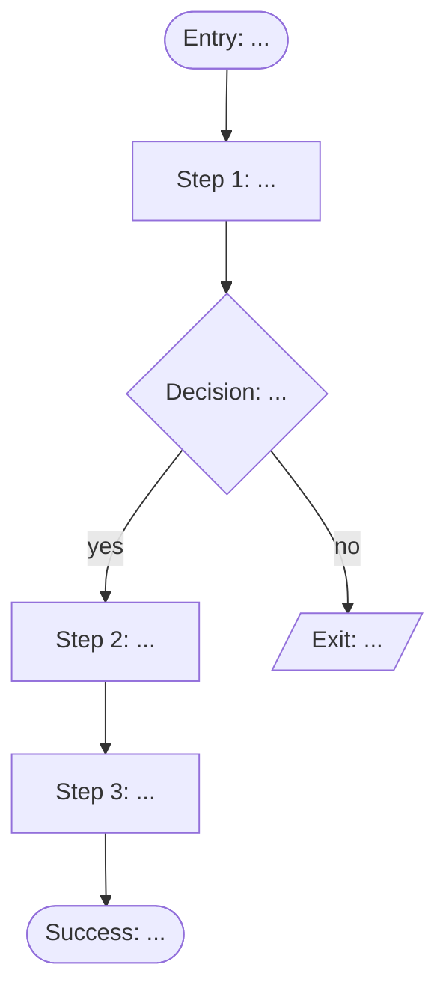

# Critical user flow: [feature name]

A flow is **structure, not screens.** It says what happens and in what order, not what the
button looks like. Keeping those separate is what lets the flow be argued about by people
who do not open Figma.

## Confidence tiers

Every element carries one. This is the most important convention in the document: a
completed flow whose invented parts are not marked is worse than an incomplete one, because
the team will build the inventions believing they were agreed.

| Tier | Meaning | Marked |
|---|---|---|
| **Observed** | It exists in the design, the spec, or the build | plain |
| **Inferred** | Not stated, but the surrounding design only makes sense with it | `~inferred~` |
| **Invented** | Filled in to make the flow complete. Nobody has agreed this | `**?invented**` |

Anything invented and load-bearing belongs in Open questions instead, not quietly in the
diagram.

---

## Coverage

Which source contains each element. Separate from the confidence tier above: tier is how sure
you are, coverage is who has it. See `references/coverage.md`.

| | In the spec | Not in the spec |
|---|---|---|
| **In the build** | `agreed` | `built-unspecified` |
| **Not in the build** | `specified-unbuilt` | `absent` |

| Element | Kind | Coverage | Evidence |
|---|---|---|---|
| | entry / step / state / branch / exit | | Quote the spec line, or say which source lacks it |

Counts, so the reader sees the shape before the detail:

- `agreed` N · `specified-unbuilt` N · `built-unspecified` N · **`absent` N**

## Entry points

Every way a user can arrive, not only the intended one.

| # | Entry | Who arrives this way | State they arrive in |
|---|---|---|---|
| E1 | (the intended route) |  |  |
| E2 | Deep link or shared URL |  |  |
| E3 | Browser back into the middle of the flow |  |  |
| E4 | Refresh mid-flow |  |  |
| E5 | Returning after abandoning |  |  |

E2 to E5 are the ones normally missing. They are also where most flows break, because
nothing designed for them exists.

---

## The flow

Every decision node needs **both** arrows drawn. A decision with one path is not a decision,
it is an assumption wearing a diamond.

---

## Steps

| # | Step | Actor | Needs (precondition) | Produces | States designed |
|---|---|---|---|---|---|
| S1 |  | user / system |  |  | ✅ success ❌ failure ❌ loading ❌ empty |
| S2 |  |  |  |  |  |

- **Actor** separates what the user does from what the system does. Blurring them is how
  flows end up with steps nobody is responsible for.
- **Needs** is the precondition. If it is not produced by an earlier step or by the entry
  state, that is a broken flow, not a detail.
- **States designed** is the highest-yield column in this document. Four per step. An
  unticked box is a state that will ship as whatever the engineer improvises.

---

## Exits

Both kinds. Unintentional exits are the ones that get forgotten.

| # | Exit | Kind | What happens to work in progress |
|---|---|---|---|
| X1 | Completed |  intentional |  |
| X2 | Cancelled by user | intentional |  |
| X3 | Abandoned (tab closed) | unintentional |  |
| X4 | Session expired | unintentional |  |
| X5 | Request failed and could not retry | unintentional |  |

"Work is lost" is a legitimate answer here. Writing it down is what makes it a decision
rather than an accident.

---

## Loops back

Where can a user go backwards, and what survives?

| From | Back to | Trigger | What is preserved |
|---|---|---|---|
|  |  | edit / retry / back button |  |

---

## Open questions

Everything load-bearing that is currently invented. Route these to a person, not to a guess.

| # | Question | Blocks | Who can answer |
|---|---|---|---|
| Q1 |  |  |  |

---

## Assumptions register

Inferred and invented elements that made it into the flow, so they can be challenged.

| Element | Tier | Why it is there | Consequence if wrong |
|---|---|---|---|
|  | inferred / invented |  |  |
